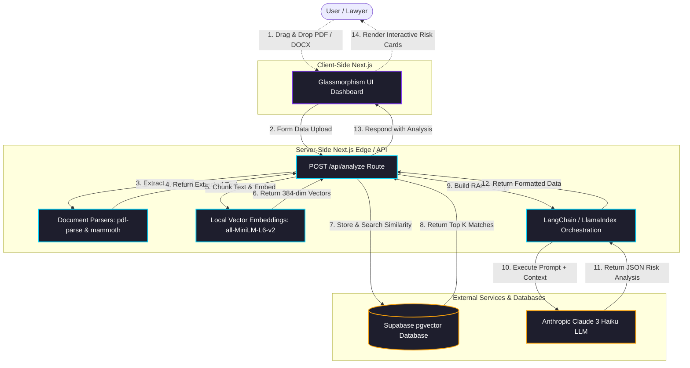

# LegalEase AI - System Architecture

This document outlines the architecture and data flow of the LegalEase AI platform. It emphasizes our secure, local-embedding strategy and the Retrieval-Augmented Generation (RAG) pipeline utilizing Supabase and Claude 3.

## Data Flow Diagram

## Component Roles

1. **Frontend UI**: Handles drag-and-drop mechanics exclusively. Validates document types natively before passing a secure FormData object buffer to the API layer.
2. **API Layer (`/api/analyze`)**: Acts as the central security and orchestration junction. Keys are securely read on the server side ensuring no exposure. 
3. **Document Parsers**: Convert unstructured buffer data into structured Raw Strings.
4. **Local Embeddings**: Converts string content into heavy 384-dimensional mathematical arrays without incurring OpenAI or remote-call latencies or costs via Transformers.js.
5. **Supabase Database**: Uses Postgres Vector indexing (`pgvector`) to rapidly calculate Nearest Neighbor distance, effectively cross-referencing global context.
6. **Claude 3 Haiku**: Examines the document chunks alongside standard precedent clauses to produce high-fidelity, highly precise JSON responses classifying risk logic.
